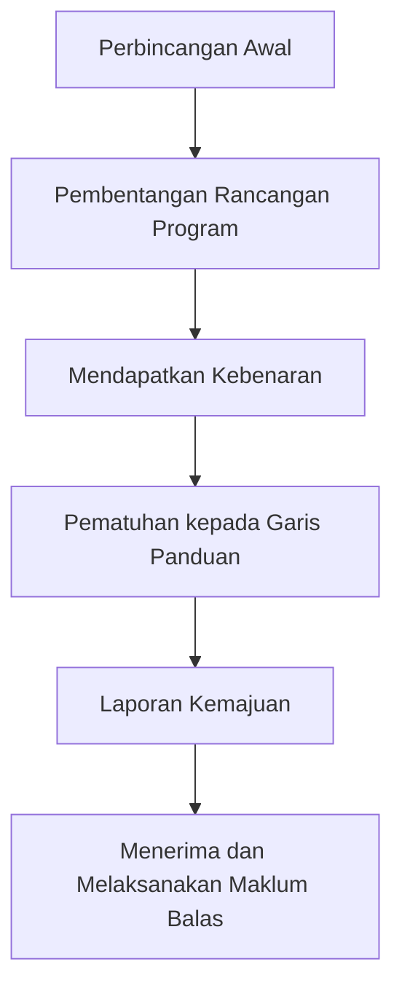

# KF2024-KTHO
Berikut adalah penjelasan tentang **Kepimpinan Beretika** semasa menjalankan program, khususnya bagi mahasiswa Universiti Teknologi Mahasiswa:

| Aspek | Penjelasan |
| --- | --- |
| **Integriti** | Sebagai pemimpin, mahasiswa perlu menunjukkan integriti dalam setiap tindakan mereka. Ini bermaksud bertindak dengan jujur, adil, dan konsisten, serta mematuhi standard etika yang tinggi. |
| **Kejujuran** | Kejujuran adalah kunci dalam kepemimpinan beretika. Pemimpin perlu selalu berkata benar dan bertindak dengan cara yang betul, walaupun ia mungkin sukar. |
| **Tanggungjawab** | Pemimpin beretika bertanggungjawab atas tindakan mereka dan keputusan yang mereka buat. Mereka perlu bersedia untuk menerima akibat dari tindakan mereka dan belajar dari kesilapan. |
| **Menghormati Orang Lain** | Menghormati orang lain adalah aspek penting dalam kepemimpinan beretika. Ini bermaksud memperlakukan orang lain dengan hormat, mendengar pendapat mereka, dan menghargai perbezaan. |
| **Keadilan** | Pemimpin beretika perlu berusaha untuk membuat keputusan yang adil dan tidak berat sebelah. Mereka perlu mempertimbangkan semua sudut pandangan dan maklumat sebelum membuat keputusan. |
| **Perkhidmatan** | Pemimpin beretika melayani orang lain, bukan diri mereka sendiri. Mereka perlu memberi tumpuan kepada apa yang terbaik untuk kumpulan atau organisasi, bukan apa yang terbaik untuk diri mereka sendiri. |

Berikut adalah penjelasan lanjutan tentang **Kepimpinan Beretika Semasa Menjalankan Program: Kepimpinan Pelajar Berasaskan Komunikasi dan Multimedia**:

| Aspek | Penjelasan |
| --- | --- |
| **Penggunaan Media Sosial** | Pemimpin beretika perlu menggunakan media sosial dan platform multimedia dengan bijaksana. Mereka perlu memastikan bahawa kandungan yang mereka kongsi tidak menyinggung atau merendahkan orang lain dan tidak melanggar hak cipta. |
| **Privasi dan Keselamatan Data** | Dalam era digital ini, pemimpin beretika perlu memahami kepentingan privasi dan keselamatan data. Mereka perlu melindungi maklumat peribadi dan rahsia organisasi dan tidak berkongsi tanpa kebenaran yang sesuai. |
| **Komunikasi Digital** | Pemimpin beretika perlu berkomunikasi secara efektif dan etika dalam persekitaran digital. Ini termasuk menjaga nada dan bahasa yang sopan dalam emel dan mesej, serta menghormati masa dan perhatian orang lain dengan tidak menghantar spam. |
| **Etika dalam Reka Bentuk** | Jika program melibatkan pembuatan produk multimedia seperti video, gambar, atau laman web, pemimpin beretika perlu memastikan bahawa reka bentuk mereka tidak meniru kerja orang lain dan bahawa semua sumber yang digunakan diberi kredit yang sesuai. |
| **Aksesibiliti** | Pemimpin beretika perlu memastikan bahawa program dan produk mereka boleh diakses oleh semua orang, termasuk orang-orang dengan keperluan khas. Ini boleh melibatkan penggunaan sarikata dalam video, memastikan laman web boleh dibaca oleh pembaca skrin, dan lain-lain. |

Berikut adalah senarai perkara-perkara yang perlu dilakukan oleh mahasiswa **sebelum** menjalankan program yang memenuhi prinsip Kepimpinan Pelajar Berasaskan Komunikasi dan Multimedia:

| Perkara | Penjelasan |
| --- | --- |
| **Rancangan Program** | Mahasiswa perlu merancang program dengan teliti, termasuk menentukan tujuan, sasaran, dan aktiviti yang akan dilakukan. |
| **Pemilihan Platform** | Mahasiswa perlu memilih platform media sosial atau multimedia yang sesuai untuk program mereka, berdasarkan demografi dan keperluan peserta. |
| **Pembinaan Kandungan** | Mahasiswa perlu membangun kandungan yang menarik dan relevan untuk program mereka, termasuk video, gambar, teks, dan lain-lain. |
| **Ujian Pratonton** | Sebelum melancarkan program, mahasiswa perlu melakukan ujian pratonton untuk memastikan semua elemen berfungsi dengan baik. |
| **Pematuhan Etika** | Mahasiswa perlu memastikan bahwa semua kandungan dan aktiviti program mematuhi prinsip-prinsip etika, termasuk hak cipta, privasi, dan aksesibiliti. |
| **Penglibatan Peserta** | Mahasiswa perlu merancang cara untuk melibatkan peserta, seperti melalui perbincangan interaktif, kuiz, atau aktiviti lain. |
| **Pemantauan dan Penilaian** | Akhirnya, mahasiswa perlu merancang bagaimana mereka akan memantau dan menilai keberkesanan program, termasuk mendapatkan maklum balas dari peserta. |

Berikut adalah huraian tentang tanggungjawab mahasiswa kepada penasihat program sebelum menjalankan program yang memenuhi prinsip Kepimpinan Pelajar Berasaskan Komunikasi dan Multimedia:

| Tanggungjawab | Penjelasan |
| --- | --- |
| **Perbincangan Awal** | Mahasiswa perlu berbincang dengan penasihat program tentang idea dan konsep program mereka. Ini termasuk tujuan, sasaran, dan aktiviti yang akan dilakukan. |
| **Pembentangan Rancangan Program** | Mahasiswa perlu membentangkan rancangan program mereka kepada penasihat untuk mendapatkan maklum balas dan nasihat. |
| **Mendapatkan Kebenaran** | Sebelum melancarkan program, mahasiswa perlu mendapatkan kebenaran dari penasihat program. Ini termasuk kebenaran untuk menggunakan platform media sosial atau multimedia tertentu. |
| **Pematuhan kepada Garis Panduan** | Mahasiswa perlu memastikan bahawa program mereka mematuhi semua garis panduan dan peraturan yang ditetapkan oleh universiti dan penasihat program. |
| **Laporan Kemajuan** | Mahasiswa perlu memberi laporan kemajuan kepada penasihat program secara berkala. Ini membolehkan penasihat untuk memantau perkembangan program dan memberikan bantuan atau nasihat jika diperlukan. |
| **Menerima dan Melaksanakan Maklum Balas** | Mahasiswa perlu menerima dan melaksanakan maklum balas dari penasihat program. Ini termasuk membuat sebarang perubahan yang diperlukan untuk memastikan program berjalan dengan lancar dan berkesan. |

Berikut adalah rajah aliran mewakili tanggungjawab mahasiswa kepada penasihat program:

Dalam rajah ini:
- `A` mewakili perbincangan awal antara mahasiswa dan penasihat program.
- `B` mewakili pembentangan rancangan program oleh mahasiswa kepada penasihat.
- `C` mewakili proses mendapatkan kebenaran dari penasihat program.
- `D` mewakili pematuhan mahasiswa kepada garis panduan dan peraturan yang ditetapkan.
- `E` mewakili laporan kemajuan yang diberikan oleh mahasiswa kepada penasihat program.
- `F` mewakili penerimaan dan pelaksanaan maklum balas dari penasihat program oleh mahasiswa.

## Perbincangan Awal
Seksyen ini merujuk kepada perbincangan awal antara mahasiswa dan penasihat program. Dalam perbincangan ini, mahasiswa perlu membincangkan idea dan konsep program mereka dengan penasihat. Berikut adalah beberapa hasil yang sepatutnya dihasilkan dalam seksyen ini:

1. **Pemahaman yang Jelas tentang Program**: Mahasiswa dan penasihat program harus mempunyai pemahaman yang jelas tentang apa yang ingin dicapai oleh program tersebut. Ini termasuk memahami tujuan, sasaran, dan aktiviti yang akan dilakukan.

2. **Rancangan Awal Program**: Berdasarkan perbincangan ini, mahasiswa harus dapat menghasilkan rancangan awal program. Rancangan ini harus mencakupi semua aspek penting program, termasuk tujuan, sasaran, aktiviti, jadual, dan sumber yang diperlukan.

3. **Persetujuan Penasihat Program**: Penasihat program harus bersetuju dengan idea dan konsep program yang dibincangkan. Jika ada sebarang isu atau kekurangan, penasihat program harus memberikan maklum balas dan cadangan untuk penambahbaikan.

4. **Dokumentasi**: Semua idea, konsep, dan rancangan yang dibincangkan harus didokumentasikan dengan baik. Dokumentasi ini akan menjadi rujukan untuk perancangan dan pelaksanaan program.

5. **Tindakan Seterusnya**: Akhir sekali, perbincangan ini harus menghasilkan senarai tindakan seterusnya. Ini termasuk apa yang perlu dilakukan oleh mahasiswa setelah perbincangan ini, seperti melakukan kajian lanjut, merancang aktiviti, atau mencari sumber.

